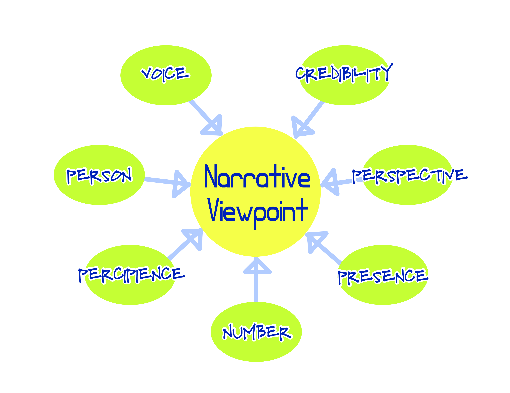

### Posting an essay on issues of viewpoint/point of view/narrative voice in fiction. Encourage discussion and pull requests!

# Seven Aspects of Viewpoint
_You’ve shifted to a new point of view here. Are you writing in third person limited? _I wrote, and then wondered what in the heck I meant. What was wrong with shifting point of view, anyway? My reader’s ear said it was wrong, but if she was writing in that narrative trick called _omniscient_, she could presumably survey the world from the mind of any character in her story. Why was it not working? When is it good, acceptable, _legal,_ to shift viewpoints, and when is it head-hopping? 
I realized I knew nothing. I needed answers.
> **This is the part of the story where I am shown in a montage, book pages, ink and computer screens floating around my head while I drink endless glasses of tea, studying the greats: E.M. Forster’s _Aspects of the Novel_, Ursula K. Le Guin’s _Steering the Craft_, and Percy Lubbock’s _The Craft of Fiction_, and then an endless parade of websites I thought were wrong, or simply repetitive.** [^1]
I got a lot of answers, but none of them satisfied. 
The topic of point of view, sometimes called narrative voice, is considered closed. You got your first person, third person limited, third person omniscient, objective, and crazy people who use second person (limited? omniscient? who knows?). End of story. **The End. **
Wait a minute. Is there a such thing as omniscient first person? (If there is, when do I get to be one?) What’s it called when the writer uses third person and first person in different places? What about when the narrator doesn’t know what characters are thinking, but does know what’s happening everywhere at once?  
And what about these? 
* _Stream of consciousness_, a term coined by the psychologist and philosopher William James in 1890 and appropriated by literary critics to refer to that moment when a writer subsumes the progress of the story into the character’s mind completely, ditching punctuation, grammar, and polite filters to allow the reader a peep at the character’s mental flotsam. 
* That naughty boy, the _unreliable narrator_, who tells the story in such a way that eventually you say to yourself, _This doesn’t mean what I thought it meant. The main character isn’t a super-spy at all, he’s a mental patient. I’ve been had!_ 
* Dialog, what Percy Lubbock called _the dramatic_ in his book, _The Craft of Fiction_. Who exactly _is_ reporting when a first person narrator steps back and lets the reader watch while she chats up another character? 
* _ Free indirect speech_ , when the third person narrator steps aside to allow the character to express themselves? 
* And the physical perspective from which action is described? 
Trying to clarify my understanding made the waters murkier. A lot of ways of narrating didn’t have a name, and might be considered illiterate by some editors because they weren’t in the manual. With dawning horror, I saw that in my own writing, I was tyrannized by the fear that I wasn’t staying in my selected point of view. 
I needed to parse for myself the parts of a narrator. I envisioned a kind of periodic table, in which writers could see the chemistry of modern fiction, and where the undiscovered territory of narration lay. (Mixing metaphors…I’m a rebel.)
It was a grand vision, but eventually I deflated, cut off my manic stream-of-consciousness chatter, and decided to make a chart of what I think are the parts of narration. 
I decided to call my analysis _Seven Aspects of Viewpoint_ because in _Aspects of the Novel_,  Forster comments that he chose the word ‘aspects’ because it is unscientific and vague, and reflects not only the ways a critic can evaluate a piece, but also how a writer can look at their own work. That’s what I want—to help writers, but also their floundering editors, who can only say, ‘Choose your point of view and stick with it. You got two, maybe three choices, and head-hopping ain’t one.’
## The State of Viewpoint
When I began my quest, I accepted that I was probably a bit dotty, and that a sound whipping with my old college standby, _Aspects of the Novel_, would return me to my senses. Unfortunately, Mr. Forster’s discussion was less than adequate to quell my confusion. After referring to Percy Lubbock, who said that the “intricate question of method” was governed by point of view, Forster textually shrugs, and opts to put “the power of the writer to bounce the reader into accepting what he says” at the center. He gives examples of narrators being _partially omniscient_, or the author using _the dramatic method_ and “inhabiting a young lady” (in which a character speaks in first person, becoming a de facto narrator). He says that as long as the author bounces us, we don’t care about shifting point of view. 
I’m inclined to agree about the bounce, but I don’t think that gives us a pass when it comes to point of view. I could wish that the reader would never have a reason to care, but with the matter so muddled, writers are forced to comply with rules that hardly exist. If we’re going to say a writer is shifting point of view too readily or too often, that a piece would make a bigger impact in third person limited than in first person, or that we think using stream of consciousness as a narrative device doesn’t serve the writer’s purposes as well as free indirect speech or internal monologue, we’d better define our terms. 
First, then, I should define the term I’ve already been wagging around, _point of view_ (or viewpoint, because I find that preposition pesky). 
The term point of view (aka, narrative voice) is applied traditionally to the identity the writer has chosen to tell the story. When the sole storyteller is an internal-to-the-fiction character using the first person pronoun ‘I,’ we accept that the writer (whom I do not call the author for reasons described later), is _not_ the storyteller. It’s easy to see that this tale teller is the writer’s puppet. But what about the writer who dispenses with the hand sock and speaks directly to the reader, referring to the characters in third person? Is there an intervening point of view or narrative voice? I say there is, and some sources agree—this is no more the writer than the firm-jawed marionette in the first example. 
There are either three, four, or five points of view accepted by the powers that be. Ursula K. Le Guin states in _Steering the Craft_ that there are five kinds of narrative voice, and bravely sets out to rename and restate them in a way that is at once refreshing and panic-inducing. I also found a book (otherwise horrible) that claimed there were twenty-two.[^2]
## Examples
For traditional examples of point of view, see _Aspects of the Novel_, Steve Almond’s article _Fiction: Point of View_, and the introduction to Trimmer and Jennings’ _Fictions_, an anthology of short fiction for the classroom. 
For more experimental examples, check out the Wikipedia entry on experimental literature [https://en.wikipedia.org/wiki/Experimental\_literature](https://en.wikipedia.org/wiki/Experimental_literature) and this list on Bookstr: [https://www.bookstr.com/experimental-novels-from-the-21st-century](https://www.bookstr.com/experimental-novels-from-the-21st-century).
## Disambiguation
### Variations on Narrative Voice and Point of View
I’ve already gnawed at the phrases _narrative voice_ and _point of view_, but I have to worry them once more. Even though many sources use them as I am, to indicate the writer’s chosen voice or voices to tell the story, others (including me, often) use them to mean something else. If I thought it would be any use at all, I would try to coin a new term for the writer’s storyteller. 
Here are other descriptions of these terms: [^3]
Narrative voice can mean how the story is conveyed, for example, through letters or retelling of experiences; it can also refer to the style, attitude or tone the writer adopts in the piece, for example, sympathetic or critical, ironic or sincere.
Point of view can mean the angle of the literary camera, whether it is pointed at the character or as if seeing from the character’s eyes (I call this perspective). It can also refer to the writer’s or character’s opinions, confusingly similar to a definition of narrative voice.
### Author, Narrator, Writer, Storyteller, Auctor
A person who writes original work is called a writer or an author. The word author sometmes refers to a published writer, but that may have lost meaning in a time when anyone can publish anything. 
According to Dictionary.com’s culture reference, [http://www.dictionary.com/browse/narrator?s=t](http://www.dictionary.com/browse/narrator?s=t), a narrator in literature is the voice that a writer takes on to tell a story, which could make it a helpful term for this thing I am trying to describe, if it weren’t used in other ways: for example, to indicate an external character who is telling the story, or a person who reads the story aloud. Storyteller has the same problem. 
So, I’ve chosen to use the phrase point of view or viewpoint to indicate the persona the writer uses to tell the story. 
To indicate a point of view external to the story, either a character or non-character, I use the word _auctor_ to differentiate from the over-used ‘author.’ Auctor, meaning an originator or vendor, is the root of the word author. It is used in legal contexts to refer to someone who has written a published work. It suggests the word actor, of which it is also a root source, a happy confluence. Ultimately, I like that _auctor_ is recognizable, but unfamiliar enough to create a pause. 
### Second Person is Not a Point of View
Second person is sometimes considered one of the primary points of view, but I don’t believe that’s true. It does something important (and difficult to pull off) for a story, but it functions more like a familiar form of third person or a distancing version of first person than a point of view all its own.[^4]
### Omniscient Does Not Mean Telepathic
Merriam-Webster’s online dictionary offers _ having infinite awareness, understanding, and insight _ as the first definition of omniscient, and gives this example: _an omniscient author_.  As the second definition, Merriam-Webster shares this: _possessed of universal or complete knowledge_, and as an example, _the omniscient God._ [https://www.merriam-webster.com/dictionary/omniscient](https://www.merriam-webster.com/dictionary/omniscient "Merriam-Webster Definition of Omniscient").
Why is the ability to see inside a character’s mind called omniscient? Omniscience is god-like—an entity that knows all and sees all. To indicate a lesser being that sees all, but does not know all, I suggest the word _omnipresent_, giving it its own part to play: _presence_, which can be either limited or omnipresent.
To define a point of view in which the _auctor_ can read the mind of only one person, the word omniscient has to be qualified with ‘limited.’ If the _auctor_ is not able to read minds, but has a view of the whole story at any time, switching from one _perspective_ to another, the critic has to say that the narrator has limited omniscience and is detached, or uses a narrative device called the camera eye. I like my critical taxonomy more tidy, so I propose that we call this aspect _percipience_, meaning ‘sensitive insight or understanding; perceptiveness,’ according to Oxford Dictionaries online [https://en.oxforddictionaries.com/definition/percipience](https://en.oxforddictionaries.com/definition/percipience). Merriam-Webster online’s second definition of the noun percipient is ’a person on whose mind a telepathic impulse or message is held to fall’ [https://www.merriam-webster.com/dictionary/percipient](https://www.merriam-webster.com/dictionary/percipient).[^5]
## Another Word or Two on Philosophy
### What kinds of fiction am I considering? 
In this analysis, I attempt to define the parts of point of view for the novel, but also for the short story, flash fiction, nonfiction novel, play, verse novel, poem, and epic. That’s my grand plan. I think it might even be possible to include non-fiction in this schema, leading me to ask:
### Is there always a narrator? 
I believe the narrator is a persona the writer wears. There is always a point of view held over the writer’s eyes. That lens reflects or distorts the writer’s personal bias to a greater or lesser degree. [^6] 
### Why redefine point of view? 
If you’re thinking, “Why redefine point of view? The old way is working for me. I’m golden,” then stop reading. You don’t need me pulling things apart and putting them back together again. I absolve you of further penance; go in peace.
However, if you are confused about point of view, aggravated by a lack of precise descriptions, or frustrated by critics who don’t accept your avant-garde use of mixed persons or multiple camera angles, read on.
## Aspects Charted
For those who enjoy a simple diagram, this is my proposal in a one page chart.

## Aspects Described
The order in which I list aspects of point of view is idiosyncratic, but deliberate, reflecting the way I think of them: voice is obvious, and controls much of the selection between traditional points of view; credibility is wrapped up with voice; person, perspective, percipience and presence are the core of traditional points of view, and number tells the reader whether there is only one point of view or more, and so comes last or first naturally. 
1. Voice: Character or Auctor
In general, the difference I am highlighting refers to whether there is, or is not, a viewpoint character, but that leads to the false impression that if the writer does not use a viewpoint character, it’s the _writer_ who is telling the story. The unreliable external narrator is evidence that this is not true. 
I dithered over whether to place an external character (for example, an inhabitant of the world writing after the fact) in the character or auctor column, but decided the external character functions more like a non-viewpoint character, often using third person and having omnipresent understanding of the story, or even percipient knowledge of more than one character. 
2. Credibility: Reliable or Unreliable
Integral to choosing a voice, whether character or auctor, is credibility. Reliable, as I am using it, means that the reader can depend on the point of view being on the whole fair, honest, and capable. An unreliable point of view might be lying, self-deluded, or just naive. 
3. Person: First or Third
Person is often held up as the central pillar of point of view, but I think it is, at most, a pilaster, appearing to support the story, but actually just a part of it. Second person functions similarly to either first or third. 
However, the person a story is told in currently dictates whether a character voice is able to be percipient with other viewpoints, omnipresent, and whether the story is told from one or another perspective, so it’s an important choice. 
In the future, writers might find a way to present a story in first person and still be omnipresent and percipient. Writers stretch boundaries all the time, sometimes to acclaim, sometimes opprobrium. But they will probably keep doing it, and I’m all for it. 
4. Perspective: Bodycam or Steadycam
I’ve adopted terms used in pop culture to offer a grip on this subject. The steadycam is a rig that allows a film technician to follow action smoothly, compensating for shake. In police work, a body camera records events from the physical perspective of an officer. 
(The best way to demonstrate the difference between the two perspectives is with a picture. See the end of the list.)
Bodycam perspective is most closely associated with the first person, but it is also used with third person, sometimes referred to as close third. Steadycam perspective is associated with third person, but can be used with first person; for example, an external auctor or internal character may tell the story as an observer.  
5. Percipience: Percipient or Detached
The percipience aspect of point of view is divided into one who knows the inner life of one or more characters, who is percipient, and one who does not know the inner life of any character, who is detached.
Teasing apart the concept of omniscience into percipience and presence accommodates the detached narrator, who sees all, but is not telepathic; the omniscient narrator, who knows thoughts, but may not be omnipresent; and the limited omniscient narrator, who knows only one mind, and may or may not be omnipresent. 
6. Presence: Limited or Omnipresent
A limited viewpoint is able to see the story from only one perspective. An omnipresent viewpoint sees the story from any perspective. The reader may feel cheated when a writer using omnipresent viewpoint is selective in revealing information that should be available to this satellite-level view.
7. Number: Single or Multiple
The writer often takes up perspectives in multiple characters—in fact, it almost defines the ‘omniscient’ point of view. But first person can also be deployed using several characters, even an auctorial voice supplemented by several character viewpoints. I suggest that these be described as multiple, rather than single, viewpoints. _Easy._

## The Five Primary Viewpoints
I don’t know how many points of view are in use in fiction, or how many may be deployed by the next great fiction writer, but I’m sure some critics will dismiss them without any recognition that they are the latest way to convey story to a new generation of readers. 
For now, I suggest that the recognized viewpoints should be identified more carefully, and understood to exist among a trove of other options. Here are my suggestions, which use Presence, Percipience and Person to name the base point of view, and present other aspects (credibility, voice, perspective), to further identify them.
### Limited Percipient Third
Similar to limited third and close third, but refers to limited presence rather than the contradictory limited omniscience.
Some points of view using **Limited Percipient Third**:
* Reliable Auctor, Limited Percipient Third, Steadycam (limited third)
* Reliable Auctor, Limited Percipient Third, Bodycam (close third)
* Unreliable Character, Limited Percipient Third, Steadycam (the viewpoint character of a con artist with a mark might carry this off)
### Limited (Percipient) First
Because first person is most likely to be percipient, this can be called _Limited First_.  Limited First is likely to use a Character voice and be in a bodycam perspective. 
A character with depersonalization disorder might move toward detachment.
Some points of view using ** Limited First**:
* Reliable Character, First, Bodycam (first person)
* Unreliable Character, First, Bodycam (first person with an unreliable narrator)
### Omnipresent Percipient Third
This is not equivalent to traditional omniscient point of view because omniscience refers to percipience only, and requires that a critic add that the narrator is able to view all the characters at once, as well as being able to read their minds. In addition, omniscient usually implies multiple viewpoint characters, and I’m applying that as a separate characteristic. 
Credibility could be in play, but traditionally, this point of view is reliable. 
Some points of view using **Omnipresent Percipient Third**:
* Reliable Auctor, Omnipresent Percipient Third, Steadycam (omniscient with omnipresence, steadycam perspective may or may not use multiple viewpoints)
* Reliable Auctor, Omnipresent Percipient Third, Bodycam, Multiple (omniscient with omnipresence, omnipresence plus bodycam perspective implies the use of multiple viewpoints)
### Omnipresent Detached Third
Le Guin has a detached author, others talk about detached, camera eye, or objective point of view. 
A detached auctor could be limited in presence, as well.
Some points of view using **Omnipresent Detached Third**:
* Reliable Auctor, Omnipresent Detached Third, Steadycam (objective or detached)
* Unreliable Auctor, Omnipresent Detached Third, Steadycam (objective or detached with unreliable narrator)
* Reliable Character, Omnipresent Detached Third, Bodycam (this would be unusual, but possible when you think of the way a bodycam or listening device is used)
### Omnipresent (Percipient) First
A first person storyteller after the fact could be, in effect, omnipresent. As with Limited First, Omnipresent First is likely to be percipient, but also likely to tell the story from a steadycam perspective. 
Some points of view using ** Omnipresent First**:
* Reliable Auctor, Omnipresent First, Steadycam (first person storyteller)
* Unreliable Auctor, Omnipresent First, Steadycam (first person unreliable storyteller)
## Shifting Point of View
A writer should change point of view _deliberately_ and for a _purpose_. You need to know point of view, and know when you are changing it.[^7] If the point of view shifts, the reader should either be informed—by changing scene or chapter or inserting the text as quote from a letter or an attributed stream of consciousness—or the unexpected shift must achieve an effect in alignment with the story’s purpose. [^8]
### Subtle Viewpoint Shifts    
On the other hand, a deliberate point of view shift can perform miracles, as in this quote from Lubbock about the use of oblique narration:
> It gives to the author the power of imperceptibly edging away from the seer, leaving his consciousness, ceasing to use his eyes—though still without substituting the eyes of another.
It might serve the story in other ways, as in the beginning of J.R.R. Tolkien’s novel _The Lord of the Rings_ when the point of view briefly shifts to that of a fox, revealing the shire’s inherent magic. 
Change in any aspect of viewpoint will appear as a point of view shift. 
* Stream of consciousness, in which the writer moves deeper into the character’s mind. 
* A perspective change from steadycam to bodycam, to see as a character sees the scene, perhaps to increase a sense of danger. 
* Free indirect speech, which allows a third person narrator to move into first person _almost_ without the reader knowing. 
* Dialog, a point of view shift so accepted, so _normal_, that no one even calls it a point of view shift. 
* Letters, diaries, authorial interjections, frame stories—all point of view shifts made acceptable by the evolution of story structure.
The problem is when a change in point of view undermines the story. 
* A reliable narrator in one place becomes unreliable, inexplicably, in another: the reader won’t stay engaged with the story. 
* Perspective switches from one character to another, especially with percipience: the reader will not be able to remember who thought or felt what, and will have to reread the passage. 
* A story told in omnipresent percipient third from multiple viewpoints doesn’t reveal an event that happens within that broad scope;  the reader feels tricked or cheated—_I should have known, I understood that I was being told everything relevant! _ [^9] 
### Experimenting with Point of View in Dreams
A dream prompted me to research point of view: I remembered the dream from the points of view of two first person characters and one auctor: 
> I am a man learning an energy control technique, a woman teaching him, and a persona watching. As the woman, I am attracted to the man, but I know it’s inappropriate in this context; as the man, I am afraid that the technique will give others power over me. As the persona, I know that they are both students, and this is an initiation into a technique to manipulate the fabric of reality.
I was struck with the number and variety of viewpoints from which I can experience a dream. I can be a character in the dream, a woman, a man, a child, an animal; I might be an observer, watching the action from near or far; I can be essentially myself, but still submerged in the dream; or I can be lucid, aware that I am myself inhabiting a dream. Sometimes I think that the dream is happening in all of these viewpoints at once, which is what makes my memory so confused when I awake. 
Dreaming and remembering dreams can be a way to experiment with point of view (and to expand consciousness, if you’re so inclined).
## Conclusion
This dive into the aspects of viewpoint has changed my attitude toward my own writing. Instead of worrying that I am not being consistent, I’ll choose my primary points of view deliberately, and notice when and why I abandon them. If the shift works, I’ll keep it. If not, I’ll try it another way. 
I hope that these _Seven Aspects of Viewpoint_ will better equip you to choose and maintain points of view thoughtfully, and perhaps even seek out subversive new strategies to tell a great story.
## Flower Diagram of the Seven Aspects
The seven aspects of narrative viewpoint, as I see them, are Voice, Credibility, Person, Percipience, Perspective, Presence, and  Number. 

## List of Sources 
I have used citations and references in a multitude of Byzantine formats, but I hate them, so these are presented as simply as I found practical.
Forster, E.M. Aspects of the Novel. Harcourt, Brace and World, 1927. 
Le Guin, Ursula K. Steering the Craft: A Twenty-First-Century Guide to Sailing the Sea of Story. 1998. Mariner Books Reprint edition, 2015. 
Lubbock, Percy. The Craft of Fiction. Charles Scribner’s Sons, 1921. 
Trimmer, Joseph F., Jennings, C. Wade. Fictions. Harcourt Brace Jovanovich, 1985. 
“Fiction: Point of View,” Steve Almond, Writers Digest website, 25 July 2008. [http://www.writersdigest.com/writing-articles/by-writing-goal/write-first-chapter-get-started/fiction-point-of-view](http://www.writersdigest.com/writing-articles/by-writing-goal/write-first-chapter-get-started/fiction-point-of-view)
“Writing in Third Person Omniscient vs Third Person Limited,” Reedsy blog, 17 November 2016. [https://blog.reedsy.com/third-person-omniscient-vs-limited/](https://blog.reedsy.com/third-person-omniscient-vs-limited/)

[^1]:	Exceptions worth reviewing are listed, quivering with hyperlinks, at the end.

[^2]:	Like the number of dimensions proposed by physicists searching for a grand theory of everything.

[^3]:	I skipped anything that was dead, slap, flipping _wrong_.

[^4]:	I’m open to other ideas, but that’s where I am right now. 

[^5]:	While ‘telepathic’ might be correct, it leads us down a whole new rabbit hole.

[^6]:	Can these aspects of viewpoint be used to explore non-fiction, such as memoir? Perhaps, but that leads to the philosophical question,  ‘Is everything fiction?’

[^7]:	Like when a writer successfully breaks grammar or punctuation rules, or when Picasso doesn’t conform to the norms of painting and plays with the appearance of reality. 

[^8]:	Intentionally disorienting the reader with shifts in viewpoint is a valid purpose—but only if it works!

[^9]:	Similar to the uncomfortable sensation at the end of a detective novel when the writer hides a vital piece of evidence and then trots it out as the solution, or to the frustration occasioned by the deus ex machina plot device, when a solution is _extremely_ fortuitous and unlikely.
